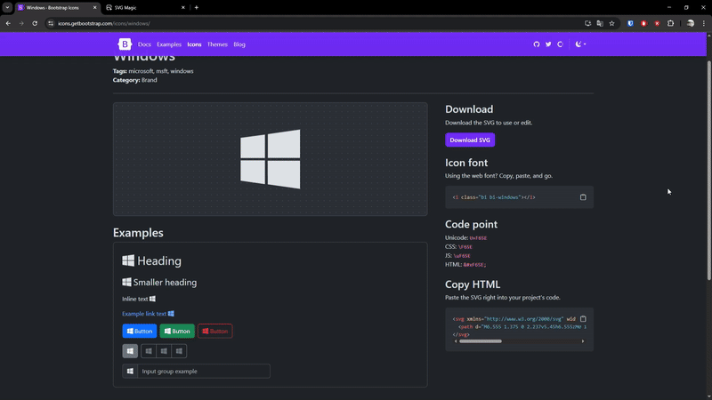
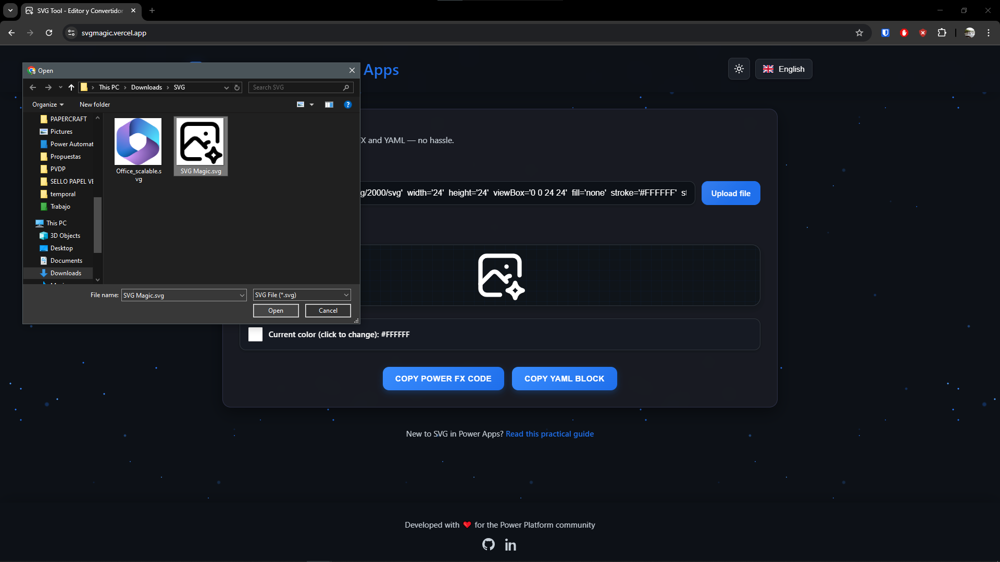
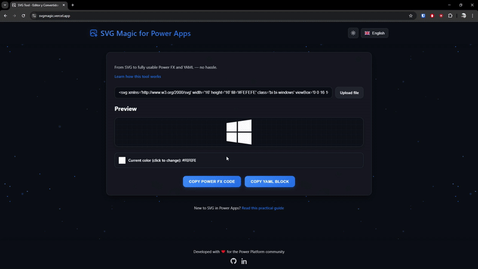
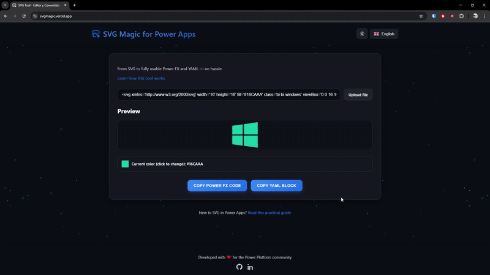

# 🧙‍♂️ SVG Magic for Power Apps

> Incluir íconos personalizados en Power Apps puede ser un desafío. Las imágenes tradicionales pueden perder calidad y dificultar la adaptación a la paleta de colores de tu aplicación. Aunque los SVG ofrecen una alternativa más flexible y escalable, integrarlos requiere manipulación manual del código y ajustes de color. **SVG Magic** simplifica este proceso, permitiéndote editar y exportar tus gráficos SVG de manera eficiente, generando el código necesario para integrarlos perfectamente en tus aplicaciones.

<div align="center">
  <a href="https://svgmagic.vercel.app" target="_blank">
      
  </a>
</div>

## 📚 Contenido

- [⚙️ Funcionalidades](#️-funcionalidades)
- [📸 Vista de la herramienta](#-vista-de-la-herramienta)
- [🚀 Cómo usar la herramienta](#-cómo-usar-la-herramienta)
- [🛠️ Cómo usar un SVG en Power Apps](#️-cómo-usar-un-svg-en-power-apps)
- [🔥 Bonus: Descarga SVGs para tus proyectos](#-bonus-descarga-svgs-para-tus-proyectos)

## ⚙️ Funcionalidades

- ✅ Pegar código SVG
- ✅ Cargar archivos SVG directamente
- ✅ Vista previa en tiempo real del SVG
- ✅ Edición de color principal
- ✅ Generación de código Power FX
- ✅ Generación de estructura YAML

## 📸 Vista de la herramienta

<div align="center">
      
</div>

## 🚀 Cómo usar la herramienta

1. Abre la app en: [https://svgmagic.vercel.app/](https://svgmagic.vercel.app/)

2. **Carga tu SVG:** Tienes dos opciones:

   - **Pegar código SVG:** Copia el código SVG desde una galería de íconos como 
     [Bootstrap Icons](https://icons.getbootstrap.com/) o 
     [Heroicons](https://heroicons.com/), y pégalo en el campo de texto.

<div align="center">
  
</div>

   - **Subir archivo SVG:** Haz clic en el botón de carga y selecciona tu archivo `.svg`.

<div align="center">
  
</div>

3. **Personaliza el color:** Si tu SVG tiene un solo color, podrás cambiarlo utilizando el selector de color. 
   *Nota: Si tu SVG tiene múltiples colores, esta funcionalidad aún no está disponible, pero estoy trabajando en ello.*

<div align="center">
  
</div>

4. **Exporta tu SVG:** Una vez personalizado, puedes:

   - 💾 Copiar código Power FX
   - 💾 Copiar estructura YAML

<div align="center">
  
</div>

5. **¡Listo!** Ahora puedes usar el código en tu aplicación Power Apps.

## 🛠️ Cómo usar un SVG en Power Apps

Dependiendo de la opción que hayas elegido anteriormente, sigue los siguientes pasos:

### Usando el código Power FX

El codigo copiado se verá asi:

INSERTAR CODIGO

<div align="center">
      
</div>

1. Abre tu aplicación en Power Apps.
2. Inserta un control de imagen ("Image").
3. En su propiedad `Image`, pega el código que copiaste desde SVG Magic.
4. Modifica el tamaño y ubica la imagen a tu gusto.

### Usando la estructura YAML

```
"data:image/svg+xml;utf8," & EncodeUrl("<svg xmlns='http://www.w3.org/2000/svg'
 width='16' height='16' fill='#16CAAA' class='bi bi-windows' viewBox='0 0 16 16'>   
<path d='M6.555 1.375 0 2.237v5.45h6.555zM0 13.795l6.555.933V8.313H0zm7.278-5.4.026 
6.378L16 16V8.395zM16 0 7.33 1.244v6.414H16z'> </path> </svg>")

```

<p>El código copiado se verá así:</p>

<pre><code>
"data:image/svg+xml;utf8," & EncodeUrl(
"data:image/svg+xml;utf8," & EncodeUrl("<svg xmlns='http://www.w3.org/2000/svg'
 width='16' height='16' fill='#16CAAA' class='bi bi-windows' viewBox='0 0 16 16'>   
<path d='M6.555 1.375 0 2.237v5.45h6.555zM0 13.795l6.555.933V8.313H0zm7.278-5.4.026 
6.378L16 16V8.395zM16 0 7.33 1.244v6.414H16z'> </path> </svg>")
</code></pre>


<p align="center">
  
</p>


1. Abre tu aplicación en Power Apps.
2. En la vista de árbol, selecciona la pantalla donde quieras insertar el SVG.
3. Haz clic en los tres puntos y selecciona "Pegar -preview-".
4. Se insertará una imagen con el nombre "SVGMagic". Modifica el tamaño y ubica la imagen a tu gusto.

## 🔥 Bonus: Descarga SVGs para tus proyectos

¿No tienes un SVG a mano? Estas páginas te ofrecen miles de recursos gratuitos y personalizables:

- [**Bootstrap Icons**](https://icons.getbootstrap.com/) – Íconos modernos del ecosistema Bootstrap.
- [**SVGL**](https://svgl.app/) – Herramienta visual para editar y copiar SVGs en segundos.
- [**Heroicons**](https://heroicons.com/) – Íconos para apps modernas, optimizados para Tailwind.
- [**Font Awesome**](https://fontawesome.com/icons) – La colección más famosa y versátil.
- [**SVG Repo**](https://www.svgrepo.com/) – Repositorio con miles de SVGs gratuitos.
- [**Iconoir**](https://iconoir.com/) – Colección open-source, elegante y robusta.
- [**Feather Icons**](https://feathericons.com/) – Íconos simples y livianos.
- [**Lucide Icons**](https://lucide.dev/) – Una versión refinada de Feather, más flexible.
- [**Tabler Icons**](https://tabler.io/icons) – Librería con estilo limpio, ideal para dashboards.
- [**SVG Silh**](https://www.svgsilh.com/) – Siluetas SVG para diseño e ilustración.
- [**Material Icons**](https://fonts.google.com/icons) – Íconos de Google, ideales para interfaces limpias.

---

<div align="center">
  <p>Hecho con ❤️ por <a href="https://github.com/sirbate">Andrés Velásquez</a></p>
  <p>Este proyecto no fue probado en producción... pero sí en sueños.</p>
</div>
