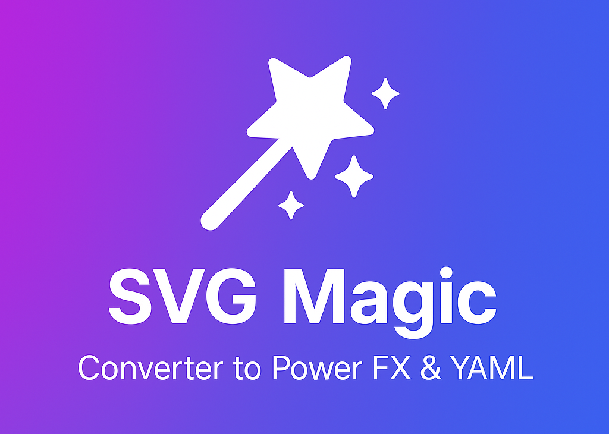
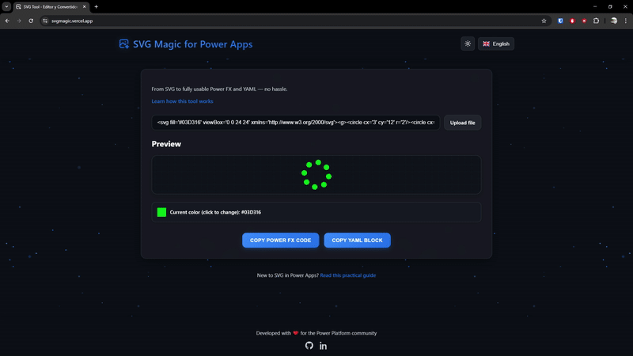

<h1>🧙‍♂️ SVG Magic for Power Apps</h1>

<blockquote>
  Incluir íconos personalizados en Power Apps puede ser un desafío. Las imágenes tradicionales pueden perder calidad y dificultar la adaptación a la paleta de colores de tu aplicación. Aunque los SVG ofrecen una alternativa más flexible y escalable, integrarlos requiere manipulación manual del código y ajustes de color. <strong>SVG Magic</strong> simplifica este proceso, permitiéndote editar y exportar tus gráficos SVG de manera eficiente, generando el código necesario para integrarlos perfectamente en tus aplicaciones.
</blockquote>

  

<h2>📚 Contenido</h2>
<ul>
  <li><a href="#funcionalidades">⚙️ Funcionalidades</a></li>
  <li><a href="#vista-de-la-herramienta">📸 Vista de la herramienta</a></li>
  <li><a href="#cómo-usar-la-herramienta">🚀 Cómo usar la herramienta</a></li>
  <li><a href="#cómo-usar-un-svg-en-power-apps">🛠️ Cómo usar un SVG en Power Apps</a></li>
  <li><a href="#descarga-svgs-para-tus-proyectos">🔥 Bonus: Descarga SVGs para tus proyectos</a></li>
</ul>

<h2 id="funcionalidades">⚙️ Funcionalidades</h2>
<ul>
  <li>✅ Pegar código SVG</li>
  <li>✅ Cargar archivos SVG directamente</li>
  <li>✅ Vista previa en tiempo real del SVG</li>
  <li>✅ Edición de color principal</li>
  <li>✅ Generación de código Power FX</li>
  <li>✅ Generación de estructura YAML</li>
</ul>

<h2 id="vista-de-la-herramienta">📸 Vista de la herramienta</h2>

      

<h2 id="cómo-usar-la-herramienta">🚀 Cómo usar la herramienta</h2>
<ol>
  <li>Abre la app en: <a href="https://svgmagic.vercel.app/">https://svgmagic.vercel.app/</a></li>
  <li>
    <strong>Carga tu SVG:</strong> Tienes dos opciones:
    <ul>
      <li>
        <strong>Pegar código SVG:</strong> Copia el código SVG desde una galería de íconos como 
        <a href="https://icons.getbootstrap.com/" target="_blank">Bootstrap Icons</a> o 
        <a href="https://heroicons.com/" target="_blank">Heroicons</a>, y pégalo en el campo de texto.
      </li>
      <li>
        <strong>Subir archivo SVG:</strong> Haz clic en el botón de carga y selecciona tu archivo <code>.svg</code>.
      </li>
    </ul>
  </li>
  <li>
    <strong>Personaliza el color:</strong> Si tu SVG tiene un solo color, podrás cambiarlo utilizando el selector de color. 
    <em>Nota: Si tu SVG tiene múltiples colores, esta funcionalidad aún no está disponible, pero estamos trabajando en ello.</em>
  </li>
  <li>
    <strong>Exporta tu SVG:</strong> Una vez personalizado, puedes:
    <ul>
      <li>💾 Copiar código Power FX</li>
      <li>💾 Copiar estructura YAML</li>
    </ul>
  </li>
  <li>
    <strong>¡Listo!</strong> Ahora puedes pegar el código en tu aplicación Power Apps.
  </li>
</ol>

<h2 id="cómo-usar-un-svg-en-power-apps">🛠️ Cómo usar un SVG en Power Apps</h2>

Dependiendo de la opción que hayas elegido anteriormente, sigue los siguientes pasos:

<h3>Usando el código Power FX</h3>
<ol>
  <li>Abre tu aplicación en Power Apps.</li>
  <li>Inserta un control de imagen ("Image").</li>
  <li>En su propiedad <code>Image</code>, pega el código que copiaste desde SVG Magic.</li>
  <li>Modifica el tamaño y ubica la imagen a tu gusto.</li>
</ol>

<h3>Usando la estructura YAML</h3>
<ol>
  <li>Abre tu aplicación en Power Apps.</li>
  <li>En la vista de árbol, selecciona la pantalla donde quieras insertar el SVG.</li>
  <li>Haz clic en los tres puntos y selecciona "Pegar -preview-".</li>
  <li>Se insertará una imagen con el nombre "SVGMagic". Modifica el tamaño y ubica la imagen a tu gusto.</li>
</ol>

<h2 id="descarga-svgs-para-tus-proyectos">🔥 Bonus: Descarga SVGs para tus proyectos</h2>

¿No tienes un SVG a mano? Estas páginas te ofrecen miles de recursos gratuitos y personalizables:

<ul>
  <li><a href="https://icons.getbootstrap.com/" target="_blank"><strong>Bootstrap Icons</strong></a> – Íconos modernos del ecosistema Bootstrap.</li>
  <li><a href="https://svgl.app/" target="_blank"><strong>SVGL</strong></a> – Herramienta visual para editar y copiar SVGs en segundos.</li>
  <li><a href="https://heroicons.com/" target="_blank"><strong>Heroicons</strong></a> – Íconos para apps modernas, optimizados para Tailwind.</li>
  <li><a href="https://fontawesome.com/icons" target="_blank"><strong>Font Awesome</strong></a> – La colección más famosa y versátil.</li>
  <li><a href="https://www.svgrepo.com/" target="_blank"><strong>SVG Repo</strong></a> – Repositorio con miles de SVGs gratuitos.</li>
  <li><a href="https://iconoir.com/" target="_blank"><strong>Iconoir</strong></a> – Colección open-source, elegante y robusta.</li>
  <li><a href="https://feathericons.com/" target="_blank"><strong>Feather Icons</strong></a> – Íconos simples y livianos.</li>
  <li><a href="https://lucide.dev/" target="_blank"><strong>Lucide Icons</strong></a> – Una versión refinada de Feather, más flexible.</li>
  <li><a href="https://tabler.io/icons" target="_blank"><strong>Tabler Icons</strong></a> – Librería con estilo limpio, ideal para dashboards.</li>
  <li><a href="https://www.svgsilh.com/" target="_blank"><strong>SVG Silh</strong></a> – Siluetas SVG para diseño e ilustración.</li>
  <li><a href="https://fonts.google.com/icons" target="_blank"><strong>Material Icons</strong></a> – Íconos de Google, ideales para interfaces limpias.</li>
</ul>

 
 

  
Hecho con ❤️ por <a href="https://github.com/sirbate">Andrés Velásquez</a>

  
Este proyecto no fue probado en producción... pero sí en sueños.

